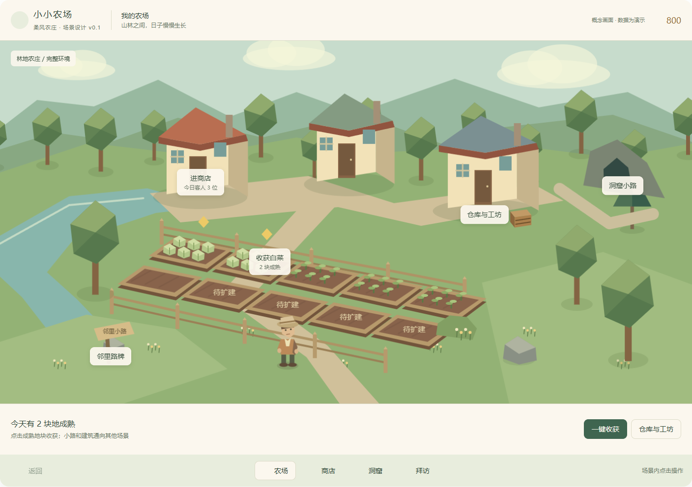
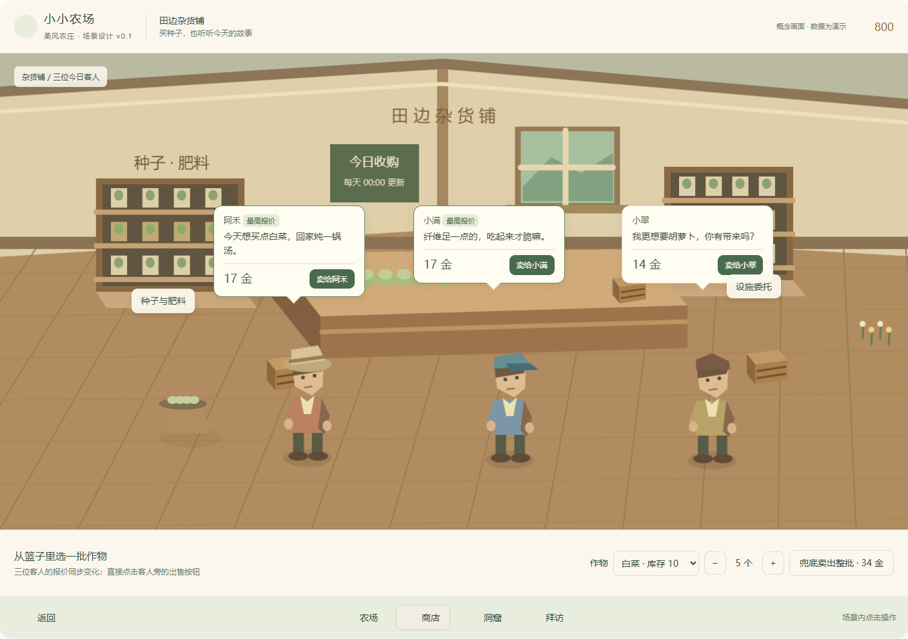
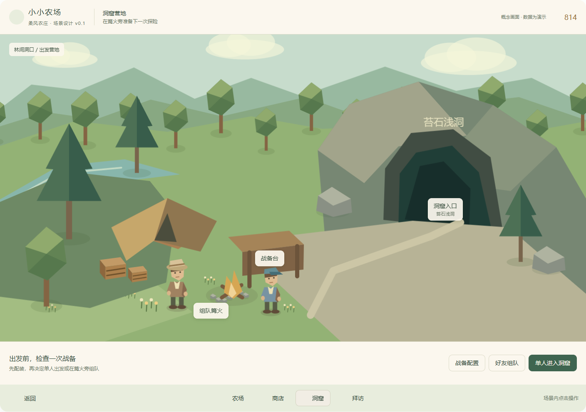
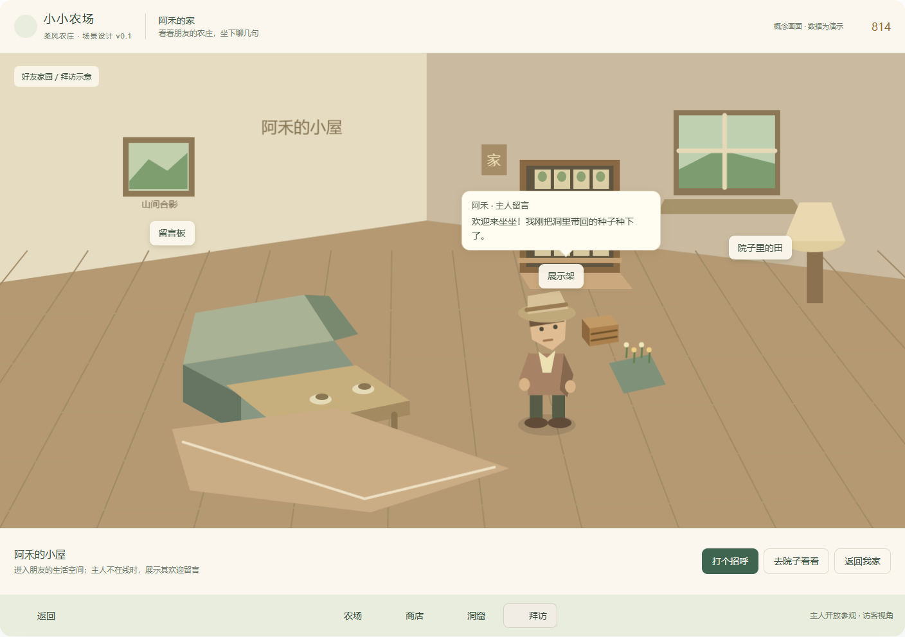
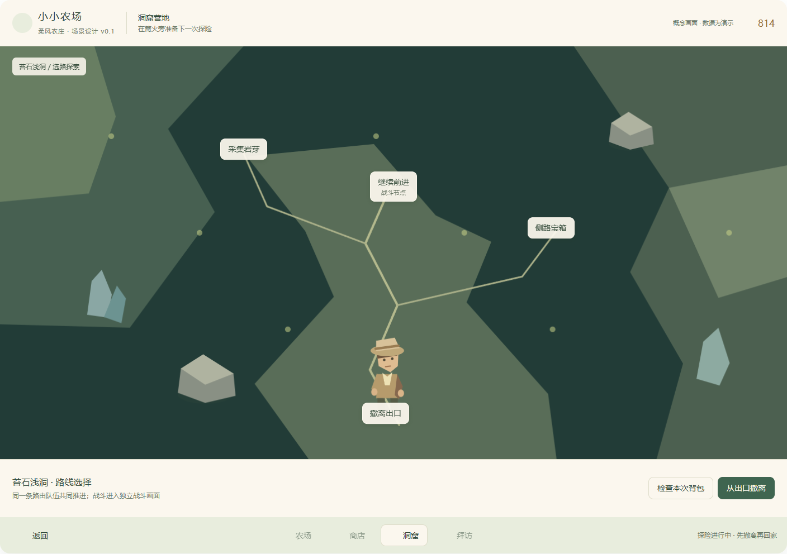
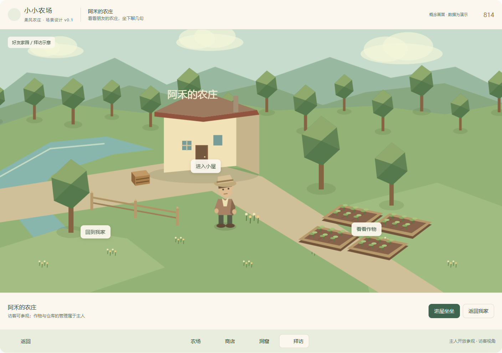

# 小小农场：多场景与空间交互设计稿 v0.1

日期：2026-10-03。状态：供评审的设计方案，包含构图示意与可点击交互稿；尚未改动游戏运行代码。示意画面中的人物、台词、库存、价格和空间比例用于说明交互，不是最终美术或新经济规则。

## 1. 设计主张

把游戏做成**一座可以串门的小农庄**：自己的农场是一处嵌在山林里的真实地点；卖菜时进入有人气的杂货铺；下洞前来到林间营地；拜访时进入朋友的院子和小屋。

每个场景有自己的主角与镜头：农场看作物，商店看客人，洞口看队友和准备，住宅看主人生活。点击建筑或路牌就切换，继续保持点击式操作，不强制增加走路、寻路或操纵角色的步骤。

屏幕先给人看见“我在哪里、这里有什么、谁在这里”，再提供当前操作。短对话直接挂在人物旁，报价挂在交易对象旁；播种、购买和配装使用贴合场景的工作区。一次操作完成后仍留在这个地方。

## 2. 当前问题与依据

本稿核对了当前 `farm_world.gd`、`farm_hud.gd`、市场定义、洞窟与联网规划，并查看 `screenshots/ui_refresh/01_farm.png`、`13_market.png` 以及洞窟入口截图。

| 当前表现 | 影响 | 本稿改变 |
| --- | --- | --- |
| 草坪、土层是一块有限矩形盒子，镜头看到整个外轮廓；周围为纯色背景 | 像漂在空中的陈列台 | 地面延伸到镜头外，用林带、溪岸、远山形成空间边界 |
| 商店、仓库、育种机、洞口、工作台、客人挤在一张农场图里 | 所有功能抢同一画面的注意力 | 经营留在农场，交易进入商店，探险准备进入洞口 |
| 集市中的人物很小，操作主要发生在大面板里 | 客人像价格按钮，缺少生活感 | 三位客人站在商店前景，短对话与实际报价同屏 |
| 洞口先弹入口面板，再开配装、组队等面板 | 玩家难以理解自己已经去到哪里 | 洞口营地承担准备；探索与战斗各有独立完整画面 |
| 最新联网规划明确暂未承诺农场互访 | 不能把拜访当成现成能力 | 把好友院子与小屋列为新增模块，先从参观做起 |

## 3. 场景结构与切换

```text
我的农场
 ├─ 杂货铺建筑 → 商店内景
 │                 ├─ 今日客人：卖菜、报价、短对话
 │                 ├─ 货架：种子、肥料
 │                 └─ 委托台：设施升级
 ├─ 洞窟小路 → 洞口营地 → 洞内探索 → 卡牌战斗
 │                 ↑          ↓           ↓
 │                 └─ 撤离结算 ←──────────┘
 └─ 邻里路牌 → 拜访目录 → 好友院子 ↔ 好友小屋

农场内：仓库／育种／制作使用固定工作区。
```

农场里的建筑、路牌是主要入口。下沿的“农场／商店／洞窟／拜访”是到访后可用的快捷导航，与场景入口指向同一目标。第一次有轻提示“点击门口进入商店”，以后不重复讲解。

普通切换不要求确认。点一下入口，入口短暂亮起，画面用约 0.2～0.35 秒过渡到新镜头，出现地点名与当地环境音；这个时长是表现目标，实际慢加载另显示进度。返回到上一级时保留作物批次、数量、浏览分类与上一场景镜头，避免反复重新选择。

探险开始后收起普通地点导航，提供路线、背包和队伍操作。回农场必须经过现有撤离或放弃流程；涉及损失的放弃保留确认。拜访不自动加入洞窟房间，组队也不自动改成拜访。

## 4. 农场：让地块真正落在大地上



### 构图

保留现有低多边形、柔和色块和斜俯视镜头。将“完整展示一个矩形地台”改为“看一片农庄”：中央田地是操作区；后方有杂货铺、仓库工坊与小屋；左侧溪流与小桥连接邻里小路；右后方林间路径通往洞口；前景有少量草丛、树干和碎石，远处有坡地与山影。

土地没有悬空的切面，草地一直延伸到视野以外。溪岸或自然坡差可以露土，但不会围绕农场四边形成一圈整齐的厚边。栅栏围的是田和院子，门口必须接上路；不能把建筑、客人和洞口全部封在同一个围栏里。

画面分为三层：

- **操作层**：十块地的最大布局及入口。作物和地块边界清楚，不能被装饰遮住。
- **生活层**：连续道路、院落、门廊、水井、作物筐、围栏缺口。细节围着玩家会操作的位置出现。
- **环境层**：树林、溪水、山丘与远景。用于形成完整世界，不增加一堆无关的可点击对象。

未购地块在农场内部表现为待开垦草地，能看出连续扩地的位置；不再因买一块地而凭空长出一块悬空地台。示意稿中的“待扩建”仅表达这一位置，正式稿以木桩、草丛和地界标识呈现。

### 镜头与操作

农场使用固定斜俯视镜头，建议俯角约 35°～45°，正交或弱透视均可，先延续当前正交方案。主操作区约占视野宽度 65%～75%，周边用于环境和道路；这些比例是初稿目标，需用真实模型和拾取验证。

成熟地仍用金色标记。悬停提示作物与剩余时间；点击空地在画面下沿展开选种条，点击生长中的地展开照料条，完成后条自动收起。收获在地块上表现产出，底部短暂显示作物、种子与经验；分数细目通过“查看本次收获”展开。

仓库、育种、制作不必在首期都做一套新室内图。点击仓库工坊后，相机轻靠近建筑，在固定一侧打开宽约 30%～38% 的工作区，农场仍可见。育种机位于仓库工坊区域，避免再独占主画面中央。

## 5. 商店：三位客人就是集市



### 空间与镜头

商店外观仍位于农场；点击建筑后切到暖色木制内景。采用去屋顶、去前墙的浅俯视内景，中央柜台在后方，左右是种子／肥料货架和设施委托区，三位今日客人在前景并排站立，彼此之间有充分空隙。

镜头比农场低、近，建议俯角约 20°～30°。人物是主体：在 1440×900 目标画面中，客人连帽高度建议约 130～170 像素；可以清楚看见服装、朝向和手中的小物件。原来站在农场栅栏前的三位客人移到这里，不需要为每位增加独立对话面板。

**合并的是场所，保留原有交易规则**：买种子与卖菜都在杂货铺里完成，但购买、客人收购、默认出售仍是明确不同操作。原 HUD 的“商店”与“集市”入口统一通向这里，可分别直接选中货架或客户区。

### 买菜客人的对话

默认每位客人只说一句短话，常显且不自动轮播；对话要能表达身份、喜好或当天心情。示例台词是新增表现文案，需与真实偏好绑定：

| 客人 | 短话示例 | 画面信息 |
| --- | --- | --- |
| 阿禾 | 今天想买点白菜，回家炖一锅汤。 | 姓名、偏好、当前报价 |
| 小满 | 纤维足一点的，吃起来才脆嘛。 | 若当天公式侧重纤维，使用此句；否则替换 |
| 小翠 | 我更想要胡萝卜，你有带来吗？ | 胡萝卜偏好、当前报价 |

每条短话约 12～26 个汉字，最多两行。内容长时，点击人物展开本人物的对话条，另外两位只保留姓名和报价。只让当前交互对象显示完整长话，不做三个轮播气泡。非对白文字和数值使用屏幕空间 UI，保持清晰，不直接当低分辨率贴图印在模型上。

气泡固定在各自人物的屏幕锚点，需处理边界、遮挡与碰撞。正式布局应为三名客人预留三个对话槽位；窗口变窄时，报价与短话移到人物下方的交易条，不缩小到不可读。

### 卖菜流程

1. 下沿“作物篮”选择批次与数量。默认带入仓库里刚点击的那批作物，保留数量。
2. 三位客人旁边同步显示当前选择对应的准确总报价。最高报价带文字“最高”，平价时都标记，不依赖颜色猜测。
3. 点击“卖给阿禾”等按钮直接成交，无中间确认框。按钮明确姓名和所选数量，避免只写“确定”。
4. 客人面向作物筐、点头，金币反馈就地出现；库存和报价更新，仍留在商店。小幅动画不阻挡连续出售。
5. 当前批次售罄时，显示售罄状态并可以换批次。兜底按钮明确“整批”，客人按钮明确“所选数量”，沿用当前不同的操作语义。

报价原因通过选中人物后的“为什么是这个价”展开：基础价、每日属性公式、偏好和批次加成按原规则展示。商店 2 级的锁客人、3 级的锁公式放在柜台公告工作区，展示当前生效和次日待生效，不能让对白取代数值解释。

每天北京时间 00:00 的客人刷新遵循服务器时间；玩家在商店跨过刷新时刻，提示“今日客人更新了”，刷新报价。成交前按原规则重新验证，价格变化须先给出新报价，不能用旧画面的价格悄悄成交。

### 买东西流程

点击种子货架，下沿交易条切为种子分类和商品；点击肥料区，切为肥料；点击设施委托台，显示升级项与条件。显示折后实际价格、数量与购买按钮，不通过人物对白隐藏必要信息。

单个商品详情可在交易条内扩展，不再打开一个遮住整间店的面板。商品较多时使用货架工作区，宽约 30%～38%，至少保留两位客人或主要室内景物可见。买后不退出商店；钱不够、仓库满等状态在相关按钮旁解释。

## 6. 洞窟：先来到入口，再真正进入洞里



洞窟拆为四个连续体验，避免把整趟探险做成农场上的面板套面板。

| 位置 | 玩家看见什么 | 主要操作 |
| --- | --- | --- |
| 洞口营地 | 山体洞口、篝火、战备台、帐篷、队友 | 配装、组队、准备、进入 |
| 洞内探索 | 当前层地貌、队伍站位、可选路径与节点 | 选路、采集、宝箱、事件、撤离 |
| 战斗空间 | 对应洞层的敌人与卡牌战斗界面 | 沿用卡牌战斗 |
| 撤离落点 | 队伍从洞口带回包裹，显示本次所得 | 查看结算、整理、回农场 |

洞口不再用现有紫色盒子代表。岩壁里嵌入一个暗洞，洞内有深度、冷色反光，洞外的暖色篝火明确是安全准备区。三层洞窟可以共用营地，通过路牌或洞口工作区选层，不强迫制作三座几乎一样的入口地图。

**配装**：点击战备台，原格子背包界面进入独立全屏工作模式或宽侧区，有清楚的“回到营地”；保留胸挂、背包、保险箱与装备卡牌信息。背包的复杂程度值得足够空间，不用一个过窄气泡替代它。点击“完成配置”后回营地，再出发。

**组队**：点击篝火，队友站位与准备状态在场景中可见。房间码、创建／加入和失败原因出现在固定队伍条；两人都准备后才可进入。好友的小屋拜访与此处的洞窟房间是不同上下文。

**洞内探索**：保持已有分叉路线与节点规则，把路线地图作为洞内场景的一部分。未揭示节点仍用图形标识，不画出未获得的信息。选择一个可达节点后镜头推进或局部切景；事件、宝箱、采集在节点旁展开一次操作区，完成后回到选路。

**战斗**：沿用现有单人／双人卡牌规则和完整战斗布局，底景换成当前洞层。战斗不是另一种新增动作玩法。结束后回到当前节点领取奖励、整理背包，再选路；不经过农场。

**撤离**：入口营地接住一次完整结算；所得物短摘要常显，详情按需展开。结算未完成时禁止开始新局；断线和重连仍按现有会话规则处理。可点击交互稿仅示意选路和撤离位置，不执行真实战斗或结算。

## 7. 拜访：先看院子，再进朋友家坐坐



邻里路牌打开拜访目录；好友条目显示昵称、是否开放参观以及最近访问入口。选中好友后，第一次落在院子，看见他的农场、建筑、作物和家门；点击家门进入小屋。以后可记住“院子／小屋”的上次访问位置。

院子可以复用农场的场景模板，绑定明确的 `owner_id`，镜头和家具按该好友的家园配置展现。至少通过屋顶色、地界、树木、陈列物和屋内摆设使主人有辨识度；不需要为每个好友手工做一套新地图。

小屋用近距离切墙内景：主人形象、茶桌、座椅、展示架和留言板。主人的欢迎语就在人物或留言板旁；窗外露一点农场景色，提醒玩家仍在同一个地方。室内对话可以更亲切，仍以人物为中心，必要时下沿显示一次回复选项。

主人在线且有实时互动能力时显示主人实时对话；主人离线时显示“主人留言”，不把静态角色冒充在线好友。原型默认采用留言示意，不连接、发送或保存真实社交消息。

### 功能边界

第一步做开放参观的家园视图、查看作物／展示架、欢迎留言，以及始终可见的“返回我家”。留言板增加固定短招呼即可形成串门感；自由输入、聊天记录与通知留到后续专门设计。

再考虑帮浇水、礼物、邀请一起下洞。帮浇水必须先确定每天限额、主人授权与收益，礼物必须明确数量、归属及服务器确认。收获、使用仓库、出售主人作物、偷菜和共同编辑家园不在本稿首期行为中。

参观是否允许离线主人、谁可访问，作为主人家园开放设置。建议首期采用主人主动开放、好友身份访问；拒绝访问、资料不可用或读取失败都在拜访目录里说明，不显示空白住宅。快照中的更新时间与实时在线标识分开，避免把旧状态看成当前状态。

最新好友联网试玩规划明确未包含互访。本稿应作为追加的设计范围，后续单独排期和验收，不据此把现有 M0～M6 自动改成已经支持拜访。

## 8. 统一信息与对话规则

| 信息／行为 | 呈现位置 |
| --- | --- |
| 当前地点、我的金币、连接状态 | 公共 HUD，轻量常显 |
| 客人的一句话、队友的准备状态、主人的欢迎语 | 对应人物旁的屏幕锚点 |
| 成熟、可交互、已锁定、未解锁 | 对应对象的短标记，文字与图形搭配 |
| 播种、照料、商品购买、报价比较、简单回复 | 画面下沿的场景操作条 |
| 仓库筛选、育种模板、配方、格子配装 | 固定工作区或完整工作画面 |
| 分数计算、报价公式、卡牌细节 | 用户点开的说明区 |
| 覆盖存档、放弃探险、送出贵重物品等重大决定 | 保留简洁确认 |

短话最多同时出现三条，靠位置说明是谁说的。长段对话只属于当前人物；切换对象收起旧段，背景人物留下短话或姓名。成交通知与错误不抢占另一名人物的对白。

默认点击主要对象就执行或展开操作；复杂功能最多一层工作区。不允许“进入场景后又弹一个同名场景入口，再从入口打开功能面板”。关闭工作区只返回当前场景；返回按钮优先退出工作模式，再返回上一个地点；ESC 关闭当前工作区，无遮挡时打开暂停。

主目标仍为桌面 1440×900，验证 1280×800、1024×640；正文 16～18 像素、辅助文字不低于 14 像素，按钮目标至少约 40～44 像素。窄窗口压缩装饰，调整对话槽位与交易条，不能依赖把所有文字缩小。交互稿另外提供窄屏重排，用于评审，不构成移动端开发承诺。

## 9. 美术方向与资产清单

继续使用已有低多边形模型语言：几何轮廓清楚，暖木、淡草绿、低饱和服装，少量金色表现成熟和金币。室外自然光、商店暖光、洞内冷暗光、住宅柔和窗光形成地点辨识度。保留现有深绿主操作和浅色面板风格，界面减少厚框。

| 场景 | 优先复用 | 新增关键资产 |
| --- | --- | --- |
| 农场 | 十块田、作物、树、栅栏、花、仓库、育种机 | 连续地形、溪岸、小桥、路径、坡地远景、院落小物 |
| 商店 | 商店外观、六位客人、种子／肥料／作物图标 | 切墙室内、柜台、货架、公告板、交易篮、人物朝向与简短动作 |
| 洞口 | 战备与洞窟玩法数据 | 山体洞口、帐篷、战备台、篝火、路牌 |
| 探索／战斗 | 路线节点、卡牌、敌人、奖励 UI | 各层底景与地貌标识，节点所在的空间表现 |
| 好友家 | 农场模板、已有装饰 | 小屋切墙模板、茶桌、展示架、留言板、主人形象配置 |

人物先做抬头、转向、点头与递物等短表现，不把首期变成完整角色行走系统。萤果与岩芽菜仍使用胡萝卜占位模型，是现有素材欠缺；它们应加入后续正式素材清单，避免漂亮场景继续展示错误作物。

环境层使用复用树群、低细节远景，碰撞只覆盖交互区。草叶、水面、光点的动效低频、可关闭；不要靠密集粒子掩盖缺失的环境。

## 10. Godot 落地结构

建议建立常驻 `WorldShell`，下设 `SceneHost` 和公共 HUD；切换的是展示地点与镜头，而不是新建一份游戏规则对象。

```text
WorldShell
 ├─ SceneRouter：地点、返回栈、进入意图、过渡
 ├─ GameContext：当前资产视图、时间、操作接口、探险上下文
 ├─ SceneHost
 │    ├─ FarmScene
 │    ├─ ShopScene
 │    ├─ CaveCampScene
 │    ├─ CaveExploreScene / BattleScene
 │    └─ VisitYardScene / VisitHouseScene
 └─ CommonHUD：地点、资源、连接状态、操作条、提示
```

`scenes/main.tscn` 当前只挂 `farm_world.gd`，该脚本 `_ready()` 创建 `FarmGame` 并读档，`GameFlow` 只传主菜单进入意图。因此不能简单在每个新场景复制它：反复切换会重新载入状态、刷新客人或重复初始化。先把资产、时间刷新和操作通道提到常驻上下文，场景只读视图并提交意图。

旧农场操作、报价、育种、仓库、战斗、配装继续调用现有领域规则。普通换地点不更改播种时间、客人抽样、探险归属或物品 ID；去商店不能刷新每日客人，回农场不能重复发收获。跨午夜的变化由同一时间服务触发。

线上版本遵守已有权威资产规划：购买、出售、播种、收获和结算走已认证服务器命令；UI 可本地预览，不在成功回执前假装资产已到账。请求处理中禁用对应提交按钮，失败后显示可重试原因；切换场景不能另起一条本地存档旁路。

互访新增只读家园视图接口，明确区分“我的账户资产”“当前观看的家园主人”和“洞窟房间成员”。家园场景复用同一模板，访问对象通过参数传入，不能因界面切换误把好友资产交给自家操作接口。

## 11. 实施顺序与验收

| 顺序 | 交付 | 评审／验收重点 |
| --- | --- | --- |
| A | 农场完整环境＋常驻场景外壳 | 全窗口无矩形悬空边；田地可点；连续切场景不重建资产 |
| B | 商店内景＋大客人＋交易条 | 三位姓名／短话／报价可同时读；买卖规则一致；批次和数量不会丢 |
| C | 洞口营地＋探索与战斗衔接 | 配装、组队、出发、奖励、撤离一路连贯；活跃局不被普通导航打断 |
| D | 自家住宅模板＋好友参观入口 | 主人信息明确；院子／小屋连续；读失败有原因；自家与好友资产隔离 |
| E | 对话动作、环境音与场景细节 | 不挡操作、不刷屏；不同地点有清楚的声画辨识度 |

第一轮视觉评审可以只做 A＋B：这两部分直接回答“漂浮的粗糙地台”和“看不清客人、满屏对话框”的问题。完整设计仍包括 C＋D，方便随后逐个落地。联网进度与场景改造分别验收，不用漂亮画面代替公网、恢复与资产验证。

具体完成标准：

1. 三个桌面目标分辨率里，四边没有裸露的地台截面或大片纯色空白；农场与林地、溪岸、小路连接自然。
2. 空地、生长、成熟、扩地状态可辨识；新增环境不挡点击和状态标记。
3. 农场到商店只需一次点击；进入后同时看到三位可辨认的客人、短话和报价。买完、卖完不退出场景。
4. 换批次、拆数量、兜底整批、同价最高、售罄、锁客人、锁公式与跨午夜刷新，全部沿用真实规则。
5. 普通往返切换十次，金币、仓库、育种、客人和作物时间没有重复初始化或额外收益。
6. 出发到结算的路线连续；已有活动局、队友未准备、断线重连都有正确入口和说明。
7. 拜访清楚展示主人和开放状态；访客不会触发主人收获、消费、买卖或编辑；返回按钮始终可用。
8. 对话和交易不相互遮挡；详细工作区可收起；关键文案无需悬停才能知道。

## 12. 调研参考

以下用于设计推导，推导结果是本稿建议，不是这些游戏直接给本项目的要求。

- [《星露谷物语》官方多人设计说明（2018）](https://www.stardewvalley.net/stardew-valley-v1-3-beta/)：住宅与玩家身份有清楚关联，访问依赖明确的会话条件。借鉴“我来到谁的地方”这一辨识，不照搬共享农场和共享资金规则。
- [《迪士尼梦幻星谷》官方商店更新（2024）](https://disneydreamlightvalley.com/news/TheLaughFloorUpdate)：用不同陈列区域承载不同商品类型。借鉴货架、柜台和区域作为功能入口，让购买发生在可见的店内空间。
- [《Ooblets》官方媒体资料](https://ooblets.com/media/)：作为明快、亲近的农场生活题材视觉参考；本稿保留本项目已有低多边形方向，不据此改成像素或复制其角色。

## 13. 本次设计稿验证

可点击稿覆盖：四类地点切换、商店更换作物／数量／成交／售罄、货架购买、洞口配装和组队示意、进入探索和撤离、住宅／院子切换、返回逻辑。所有交互使用临时演示状态，不读取或保存真实游戏档，也不发送好友消息。

已通过浏览器中的主要交互检查，并在 1440、1280、1024、736、360、320 像素六种视口宽度下检查四类场景，共 24 组布局；未发现运行错误、操作按钮横向溢出或不可读的小字号。另已人工查看农场、商店、洞口、小屋与窄屏画面，确认场景和人物对话完整显示。检查记录在 `screenshots/design_multiscene_2026-10-03/verification.json`。

这些结果验证的是交互设计稿。正式模型、真实游戏窗口内的可读性、拾取、服务器命令与真实双人过程须在实施阶段另行验证。

补充构图：




