# 小小农场：多场景与空间交互设计稿 v0.4

日期：2026-10-03。状态：按本次反馈修订的场景与交互设计稿，尚未改动游戏运行代码。v0.4 的重点是支持多个朋友的拜访选择：点击信箱、小桥或农场里的邻里房屋，先打开场内“邻里地址簿”，点击朋友的家到达他的院子，再点房子进屋。保留店门、石阶、院门与天光洞口等自然入口。继续保留全部操作位于游戏视口内、先点击物体再展开操作的规则。人物、台词、库存、价格和空间比例仍用于交互示意。

项目内保存：[可点击预览](previews/farm-scenes-v0.4.html)（用浏览器打开）｜[可编辑预览源稿](previews/farm-scenes-v0.4.fragment.html)｜[预览说明](previews/README.md)。本稿中的截图与交互验证记录一并保存在项目的 `screenshots/design_multiscene_2026-10-03_v04/`。

## 1. 设计主张

把游戏做成**一座可以串门的小农庄**：自己的农场是一处嵌在山林里的真实地点；卖菜时进入有人气的杂货铺；下洞前来到林间营地；拜访时进入朋友的院子和小屋。

每个场景有自己的主角与镜头：农场看作物，商店看客人，洞口看队友和准备，住宅看主人生活。普通地点点击建筑、石阶或院门就切换；拜访入口先选朋友，继续保持点击式操作，不强制增加走路、寻路或操纵角色的步骤。

屏幕先给人看见“我在哪里、这里有什么、谁在这里”，再提供当前操作。短对话直接挂在人物旁，报价挂在交易对象旁。**先点击场景物体，再在游戏画面内展开这个物体的操作**；操作完成后收起界面，人仍留在这个地方。

### 不同地点，使用不同的自然入口

入口应让玩家看出这里是什么、能去哪里。此次推荐一套组合：杂货铺以条纹雨棚、门廊、菜筐和敞开的门辨认；邻里通过溪上的石桥连接；洞窟通过岩石台阶和提灯引导；好友院子通过半开的花藤铁门回程；洞内通过透进日光的出口撤离。建筑名牌与留言板保留各自的身份和留言用途。

木牌只在真正需要指方向的分岔路出现，首期交互稿无需设置。避免给每处建筑前再放一根相同的告示牌。

| 入口 | 第一眼如何辨认 | 悬停／键盘聚焦提示 | 点击结果 |
| --- | --- | --- | --- |
| 杂货铺门廊 | 绿白条纹雨棚、门口菜筐、敞开的门 | 进杂货铺 | 直接进入商店内景 |
| 上山石阶 | 高差、灰色石阶、岩壁与提灯，路径朝洞口延伸 | 去洞窟营地 | 直接到洞口准备区 |
| 邻里信箱／石桥 | 信箱带信件和小旗，小桥跨过真实溪流 | 选择拜访朋友 | 打开邻里地址簿，选择后到指定好友院子 |
| 已到达的好友小屋 | 当前主人名牌、屋顶色与门前花盆 | 进当前朋友家 | 直接进屋，保持同一主人 |
| 好友院门 | 半开的铁门、石柱和花藤，门外道路延续 | 回我的农庄 | 返回农场 |
| 营地下山小路 | 明确可见的路口、林带缺口和一盏路灯 | 下山回农庄 | 返回农场 |
| 洞内撤离口 | 岩壁开口、洞外植被和透进来的天光 | 查看撤离 | 先展开撤离操作，再确认回营地 |

**外形丰富，交互规律一致**：门与建筑用于进入；桥、石阶和路口用于换地点；货架、篮子、战备台等用于打开操作；人物用于交流或交易。普通地点一次点击到达；通往多个好友家的入口先选择对象，探险开始或结算的入口展开对应操作界面。继续采用点击切换，不要求玩家先操纵角色走到目标。

### 本次修订的操作对应表

| 玩家要做什么 | 首先点击什么 | 之后发生什么 |
| --- | --- | --- |
| 农场去商店 | 条纹雨棚下的店门／门廊 | 直接切换商店内景 |
| 商店回农场 | 商店的门 | 直接回到农场 |
| 空地播种／生长期照料／成熟收获 | 对应状态的田地 | 在地块附近展开种子、照料或收获界面 |
| 扩地／仓库／制作 | 待开垦草地／仓库建筑／工坊台 | 在游戏内展开对应工作区 |
| 选择卖菜批次与数量 | 自己带来的作物篮 | 展开批次与数量选择，选好后收起 |
| 和客人交易 | 客人本人 | 出现他的短话、当前报价与出售按钮 |
| 买种子／肥料、升级设施 | 对应货架或委托台 | 展开该货架的购买或委托界面 |
| 去洞窟营地／回农庄 | 提灯旁的上山石阶／营地下山小路 | 切换地点 |
| 进入洞窟 | 山体里的洞口 | 先展开出发界面，再选择进入、战备或组队 |
| 配装／组队 | 战备台／篝火 | 打开战备或队伍界面 |
| 洞内开始战斗／开宝箱／采集 | 敌人／宝箱／资源点 | 展开遭遇、物资或采集界面，再推进对应玩法 |
| 撤离 | 岩壁中透着天光的出口 | 展开撤离操作，确认后回营地 |
| 从田地去好友家 | 信箱、小桥或农场里的邻里房屋 | 打开邻里地址簿；点击朋友的家进入他的院子 |
| 从好友院子进屋 | 院子里的房子 | 直接进入当前朋友的小屋 |
| 从小屋出去 | 房门；窗户也可作为查看院子的快捷入口 | 回到好友院子 |
| 从好友院子回来 | 花藤院门 | 返回自己的农场 |
| 打招呼／看展示物 | 主人／留言板／展示架 | 在场内展开这个对象的内容 |

取消上一版游戏画面下方的四地点导航和常驻操作栏。按钮仍可用于精确提交操作，但它们出现于已选物体的场内界面；不承担玩家尚未接触场景物体时的默认入口。

## 2. 当前问题与依据

本稿核对了当前 `farm_world.gd`、`farm_hud.gd`、市场定义、洞窟与联网规划，并查看 `screenshots/ui_refresh/01_farm.png`、`13_market.png` 以及洞窟入口截图。

| 当前表现 | 影响 | 本稿改变 |
| --- | --- | --- |
| 草坪、土层是一块有限矩形盒子，镜头看到整个外轮廓；周围为纯色背景 | 像漂在空中的陈列台 | 地面延伸到镜头外，用林带、溪岸、远山形成空间边界 |
| 商店、仓库、育种机、洞口、工作台、客人挤在一张农场图里 | 所有功能抢同一画面的注意力 | 经营留在农场，交易进入商店，探险准备进入洞口 |
| 集市中的人物很小，操作主要发生在大面板里 | 客人像价格按钮，缺少生活感 | 三位客人站在商店前景，短对话与实际报价同屏 |
| 洞口先弹入口面板，再开配装、组队等面板 | 玩家难以理解自己已经去到哪里 | 洞口营地承担准备；探索与战斗各有独立完整画面 |
| 最新联网规划明确暂未承诺农场互访 | 不能把拜访当成现成能力 | 把好友院子与小屋列为新增模块，先从参观做起 |

## 3. 场景结构与切换

```text
我的农场
 ├─ 杂货铺建筑 → 商店内景
 │                 ├─ 今日客人：卖菜、报价、短对话
 │                 ├─ 货架：种子、肥料
 │                 └─ 委托台：设施升级
 ├─ 洞窟小路 → 洞口营地 → 洞内探索 → 卡牌战斗
 │                 ↑          ↓           ↓
 │                 └─ 撤离结算 ←──────────┘
 └─ 邻里信箱／石桥／邻里房屋 → 邻里地址簿 → 指定好友院子 ↔ 该好友小屋

农场内：仓库／育种／制作使用固定工作区。
```

建筑、门廊、小桥、石阶、院门和路径是地点入口。没有独立于游戏画面的地点导航条；回程也由当前场景中看得见的店门、院门或下山路口完成。首次到达用轻提示说明可点击物体，之后通过悬停高亮和短标签帮助识别。

普通切换不要求确认。点一下入口，入口短暂亮起，画面用约 0.2～0.35 秒过渡到新镜头，出现地点名与当地环境音；这个时长是表现目标，实际慢加载另显示进度。返回到上一级时保留作物批次、数量、浏览分类与上一场景镜头，避免反复重新选择。

探险中只有符合当前阶段的路径和物体可以交互。回农场必须先点击出口并完成现有撤离或放弃流程；涉及损失的放弃保留确认。拜访不自动加入洞窟房间，组队也不自动改成拜访。

## 4. 农场：让地块真正落在大地上

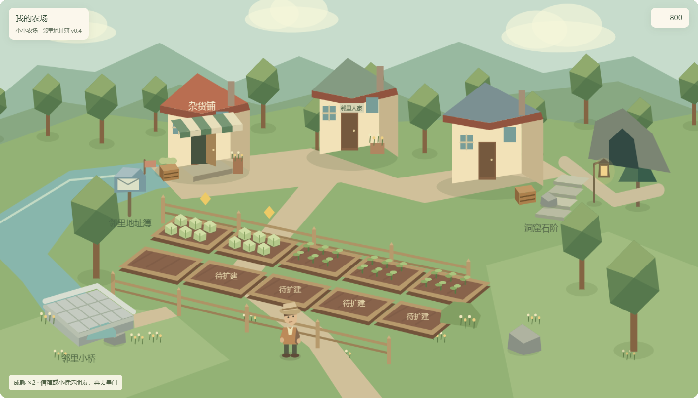

### 构图

保留现有低多边形、柔和色块和斜俯视镜头。将“完整展示一个矩形地台”改为“看一片农庄”：中央田地是操作区；后方有杂货铺、仓库工坊与小屋；左侧溪流与小桥连接邻里小路；右后方林间路径通往洞口；前景有少量草丛、树干和碎石，远处有坡地与山影。

土地没有悬空的切面，草地一直延伸到视野以外。溪岸或自然坡差可以露土，但不会围绕农场四边形成一圈整齐的厚边。栅栏围的是田和院子，门口必须接上路；不能把建筑、客人和洞口全部封在同一个围栏里。

画面分为三层：

- **操作层**：十块地的最大布局及入口。作物和地块边界清楚，不能被装饰遮住。
- **生活层**：连续道路、院落、门廊、水井、作物筐、围栏缺口。细节围着玩家会操作的位置出现。
- **环境层**：树林、溪水、山丘与远景。用于形成完整世界，不增加一堆无关的可点击对象。

未购地块在农场内部表现为待开垦草地，能看出连续扩地的位置；不再因买一块地而凭空长出一块悬空地台。示意稿中的“待扩建”仅表达这一位置，正式稿以木桩、草丛和地界标识呈现。

### 镜头与操作

农场使用固定斜俯视镜头，建议俯角约 35°～45°，正交或弱透视均可，先延续当前正交方案。主操作区约占视野宽度 65%～75%，周边用于环境和道路；这些比例是初稿目标，需用真实模型和拾取验证。

成熟地仍用金色标记。悬停提示作物与剩余时间；点击空地在地块附近展开选种界面，点击生长中的地展开照料界面，成熟地打开收获操作。完成后界面收起，产出在地块上表现，游戏视口内短暂显示作物、种子与经验；分数细目按需展开。

仓库、育种、制作不必在首期都做一套新室内图。点击仓库工坊后，相机轻靠近建筑，在固定一侧打开宽约 30%～38% 的工作区，农场仍可见。育种机位于仓库工坊区域，避免再独占主画面中央。

## 5. 商店：三位客人就是集市

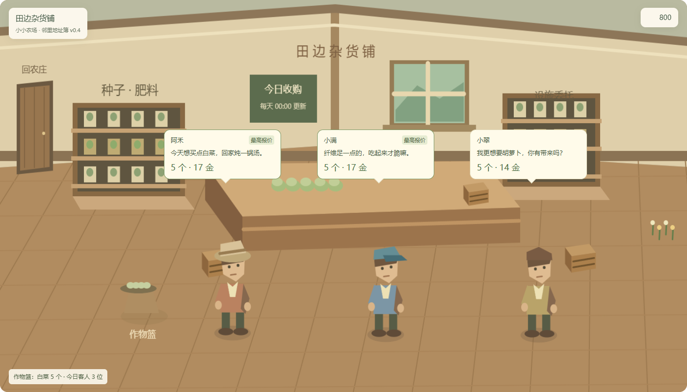

### 空间与镜头

商店外观仍位于农场；绿白条纹雨棚、菜筐和敞开的店门使它与普通住宅区分。点击门廊或建筑后切到暖色木制内景。采用去屋顶、去前墙的浅俯视内景，中央柜台在后方，左右是种子／肥料货架和设施委托区，三位今日客人在前景并排站立，彼此之间有充分空隙。

镜头比农场低、近，建议俯角约 20°～30°。人物是主体：在 1440×900 目标画面中，客人连帽高度建议约 130～170 像素；可以清楚看见服装、朝向和手中的小物件。原来站在农场栅栏前的三位客人移到这里，不需要为每位增加独立对话面板。

**合并的是场所，保留原有交易规则**：买种子与卖菜都在杂货铺里完成，但购买、客人收购、默认出售仍是明确不同操作。功能入口落实为货架、作物篮、客人与委托台；不再在画面外并列“商店／集市”按钮。

### 买菜客人的对话

默认每位客人只说一句短话，常显且不自动轮播；对话要能表达身份、喜好或当天心情。示例台词是新增表现文案，需与真实偏好绑定：

| 客人 | 短话示例 | 画面信息 |
| --- | --- | --- |
| 阿禾 | 今天想买点白菜，回家炖一锅汤。 | 姓名、偏好、当前报价 |
| 小满 | 纤维足一点的，吃起来才脆嘛。 | 若当天公式侧重纤维，使用此句；否则替换 |
| 小翠 | 我更想要胡萝卜，你有带来吗？ | 胡萝卜偏好、当前报价 |

每条短话约 12～26 个汉字，最多两行。内容长时，点击人物展开本人物的对话条，另外两位只保留姓名和报价。只让当前交互对象显示完整长话，不做三个轮播气泡。非对白文字和数值使用屏幕空间 UI，保持清晰，不直接当低分辨率贴图印在模型上。

气泡固定在各自人物的屏幕锚点，需处理边界、遮挡与碰撞。正式布局应为三名客人预留三个对话槽位；窗口变窄时，报价与短话在游戏内部重排，不缩小到不可读，也不移到游戏画面以外。

### 卖菜流程

1. 点击场景中的作物篮，才展开批次与数量选择。默认带入仓库里刚点击的那批作物，保留数量；选择好之后收起。
2. 三位客人旁边同步显示当前选择对应的准确总报价。最高报价带文字“最高”，平价时都标记，不依赖颜色猜测。
3. 点击阿禾本人，在他附近打开交易界面；界面里的“卖给阿禾”按钮才执行成交。这个界面兼顾人物短话、所选数量和准确报价，不再另外套一个确认框。
4. 客人面向作物筐、点头，金币反馈就地出现；库存和报价更新，仍留在商店。小幅动画不阻挡连续出售。
5. 当前批次售罄时，显示售罄状态并可以换批次。兜底按钮明确“整批”，客人按钮明确“所选数量”，沿用当前不同的操作语义。

报价原因通过选中人物后的“为什么是这个价”展开：基础价、每日属性公式、偏好和批次加成按原规则展示。商店 2 级的锁客人、3 级的锁公式放在柜台公告工作区，展示当前生效和次日待生效，不能让对白取代数值解释。

每天北京时间 00:00 的客人刷新遵循服务器时间；玩家在商店跨过刷新时刻，提示“今日客人更新了”，刷新报价。成交前按原规则重新验证，价格变化须先给出新报价，不能用旧画面的价格悄悄成交。

### 买东西流程

点击种子货架，在货架附近展开种子商品；点击肥料区，展开肥料；点击设施委托台，显示升级项与条件。显示折后实际价格、数量与购买按钮，不通过人物对白隐藏必要信息。未点击物体时，这些购买按钮不常驻。

单个商品详情在同一场内界面扩展。商品较多时使用货架工作区，宽约 30%～38%，至少保留两位客人或主要室内景物可见。买后不退出商店；钱不够、仓库满等状态在相关按钮旁解释。所有界面均限制在游戏视口安全边界内。

## 6. 洞窟：先来到入口，再真正进入洞里

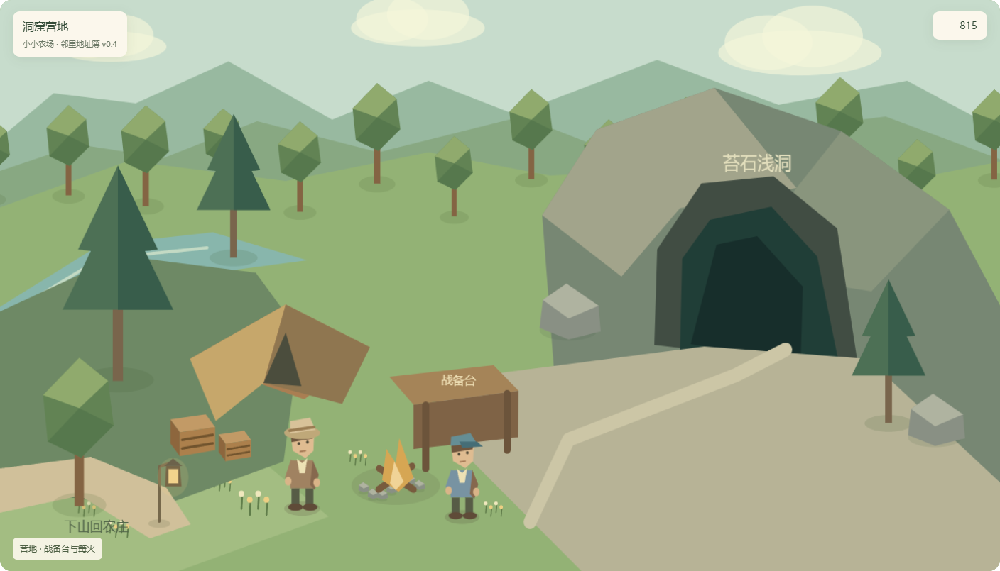

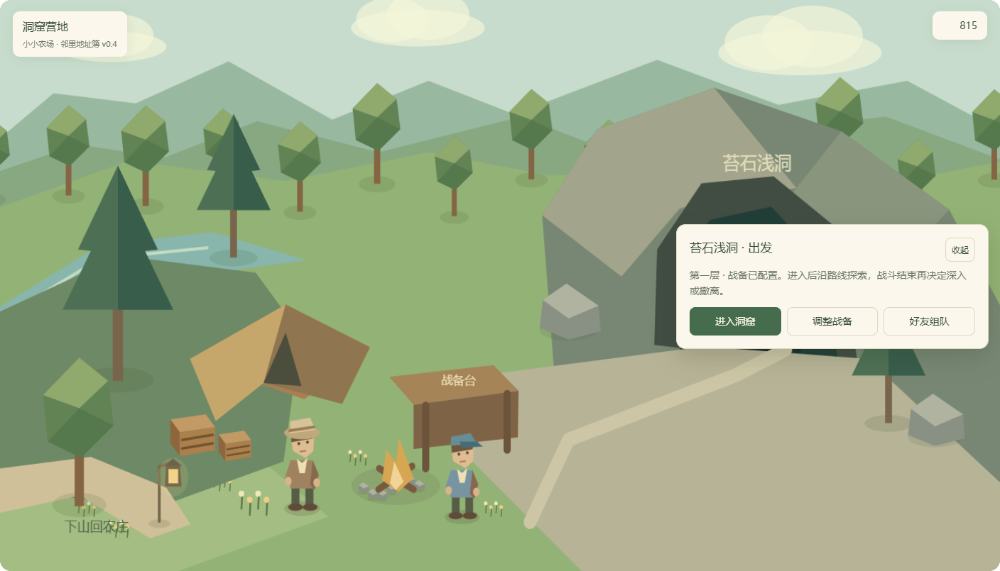

洞窟拆为四个连续体验，避免把整趟探险做成农场上的面板套面板。

| 位置 | 玩家看见什么 | 主要操作 |
| --- | --- | --- |
| 洞口营地 | 山体洞口、篝火、战备台、帐篷、队友 | 配装、组队、准备、进入 |
| 洞内探索 | 当前层地貌、队伍站位、可选路径与节点 | 选路、采集、宝箱、事件、撤离 |
| 战斗空间 | 对应洞层的敌人与卡牌战斗界面 | 沿用卡牌战斗 |
| 撤离落点 | 队伍从洞口带回包裹，显示本次所得 | 查看结算、整理、回农场 |

洞口不再用现有紫色盒子代表。岩壁里嵌入一个暗洞，洞内有深度、冷色反光，洞外的暖色篝火明确是安全准备区。**点洞口才打开出发界面**，其中显示洞层、战备状态与“进入洞窟”；营地默认没有常驻的出发按钮。三层洞窟可以共用营地，通过洞口工作区选层。农场里的提灯石阶只是通向营地；到营地后才点击洞口确认出发，避免把上山误当成立即开战。

**配装**：点击战备台，原格子背包界面进入独立全屏工作模式或宽侧区，有清楚的“回到营地”；保留胸挂、背包、保险箱与装备卡牌信息。背包的复杂程度值得足够空间，不用一个过窄气泡替代它。点击“完成配置”后回营地，再出发。

**组队**：点击篝火，队友站位与准备状态在场景中可见。房间码、创建／加入和失败原因出现在固定队伍条；两人都准备后才可进入。好友的小屋拜访与此处的洞窟房间是不同上下文。

**洞内探索**：保持已有分叉路线与节点规则，把路线地图作为洞内场景的一部分。未揭示节点仍用图形标识，不画出未获得的信息。选择一个可达节点后镜头推进或局部切景；事件、宝箱、采集在节点旁展开一次操作区，完成后回到选路。

**战斗**：沿用现有单人／双人卡牌规则和完整战斗布局，底景换成当前洞层。战斗不是另一种新增动作玩法。结束后回到当前节点领取奖励、整理背包，再选路；不经过农场。

**撤离**：点击岩壁中透着天光的出口，展开撤离操作并确认，入口营地接住一次完整结算；所得物短摘要常显，详情按需展开。结算未完成时禁止开始新局；断线和重连仍按现有会话规则处理。可点击交互稿仅示意选路和撤离位置，不执行真实战斗或结算。

## 7. 拜访：先看院子，再进朋友家坐坐

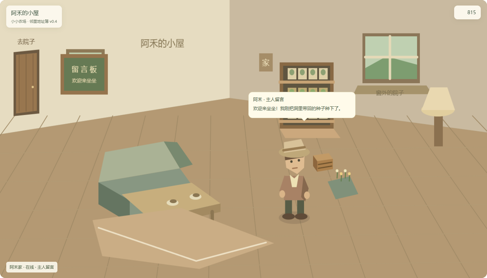

**推荐流程：点信箱 → 选择朋友的家 → 到他的院子 → 点房子进屋。** 多个好友共用一个自然入口，农场不因好友数量增加而摆满住宅模型。

农场中的信箱挂着信件与小旗，点击打开游戏视口内的“邻里地址簿”。溪上的小桥和远处的邻里房屋也打开同一本地址簿；它们不会自动把玩家送到默认朋友家。农场里的房屋用“邻里人家”表示方向；只有到达具体朋友的院子后，房屋名牌才对应那位主人，并可直接进屋。无论好友数量多少，都采用同一流程。

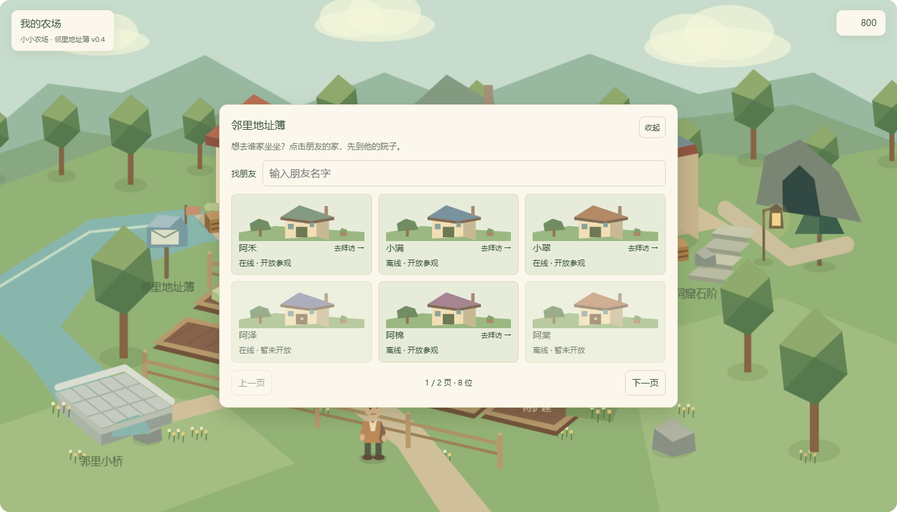

### 地址簿里看什么、怎么选

每个朋友占一张住宅条目，显示可辨认的房屋缩略图、昵称、在线状态及家园开放状态。不同屋顶色与院落细节帮助记忆，但昵称是确定身份的依据。整张条目是一个明确的“去拜访”操作；点击后直接到该朋友院子，不先进入详情、再套确认框。

| 朋友状态 | 地址簿表现 | 能否进入 |
| --- | --- | --- |
| 在线且开放 | “在线 · 开放参观” | 可以 |
| 离线但开放 | “离线 · 开放参观” | 可以参观允许读取的家园快照，屋里显示主人留言 |
| 暂未开放 | 明确写“暂未开放”，保留昵称和房屋外观 | 进入操作禁用，仍可看出原因 |
| 读取失败或权限已变化 | 在所选条目附近说明原因，保留选择画面 | 可以重试或换另一位朋友 |

桌面大窗口每页展示六个朋友；较矮或较窄的窗口减少每页条目，保证整本地址簿和翻页按钮留在游戏矩形内。提供按昵称查找和上一页／下一页，匹配不到时显示简短空状态。查询不改变家园权限。后端分页与名字查询可以承接更多好友，不依赖一次加载所有家园详情。

上次拜访的朋友在重新打开地址簿时靠前，并标注“上次拜访”，仍由玩家点击决定去向。第一次打开不替玩家选定好友。关闭地址簿回到当前农场，ESC 也可收起；没有新增画面外导航。

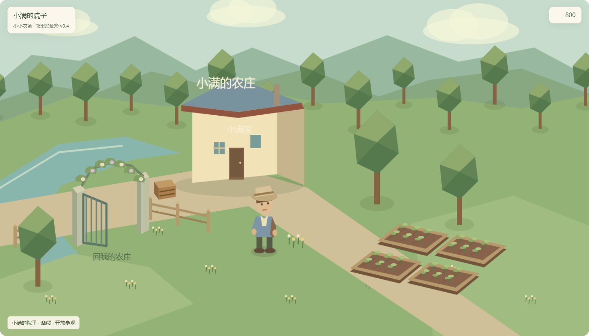

### 进入后保持同一个主人

选择结果传入指定的 `owner_id`。院子地点名、房门名牌、屋顶、主人形象、作物说明、展示物和屋内留言都来自这一位朋友。院子点房子进屋，屋里点门或窗回院子，仍保持同一个 `owner_id`；院门返回自己的农场。

换朋友需要回到农场重新打开地址簿。这个首期规则让地点与身份始终清楚，并避免在好友家里再铺一套重复导航。以后若频繁连续拜访，再在好友院门旁增加地址簿入口。

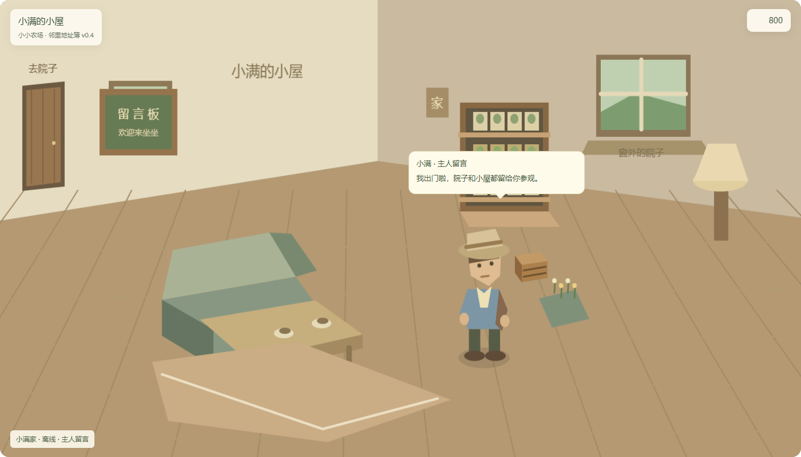

交互稿提供八位示例朋友，覆盖在线开放、离线开放和暂未开放；这些是设计演示数据。打招呼的演示记录按主人分别保留，拜访另一位朋友不会沿用上一位的对话。真实家园开放、快照读取和留言能力仍需另行实现。

院子可以复用农场的场景模板，绑定明确的 `owner_id`，镜头和家具按该好友的家园配置展现。至少通过屋顶色、地界、树木、陈列物和屋内摆设使主人有辨识度；不需要为每个好友手工做一套新地图。

小屋用近距离切墙内景：主人形象、茶桌、座椅、展示架、留言板，以及看得见的门和窗。主人的欢迎语就在人物旁；点击主人或留言板再显示回复选项。点击房门回院子；窗户显示外面的同一院子，也提供点击切换到院子的快捷入口。窗口的交互语义是“看看外面”，场景切换后仍可点击房子回屋。

主人在线且有实时互动能力时显示主人实时对话；主人离线时显示“主人留言”，不把静态角色冒充在线好友。原型默认采用留言示意，不连接、发送或保存真实社交消息。

### 功能边界

第一步做开放参观的家园视图、查看作物／展示架、欢迎留言、门窗与花藤院门。出口是可辨认的实体物件：小屋里看门，院子里看半开院门和门外的路。留言板增加固定短招呼即可形成串门感；自由输入、聊天记录与通知留到后续专门设计。

再考虑帮浇水、礼物、邀请一起下洞。帮浇水必须先确定每天限额、主人授权与收益，礼物必须明确数量、归属及服务器确认。收获、使用仓库、出售主人作物、偷菜和共同编辑家园不在本稿首期行为中。

参观是否允许离线主人、谁可访问，作为主人家园开放设置。建议首期采用主人主动开放、好友身份访问；拒绝访问、资料不可用或读取失败都在拜访目录里说明，不显示空白住宅。快照中的更新时间与实时在线标识分开，避免把旧状态看成当前状态。

最新好友联网试玩规划明确未包含互访。本稿应作为追加的设计范围，后续单独排期和验收，不据此把现有 M0～M6 自动改成已经支持拜访。

## 8. 统一信息与对话规则

| 信息／行为 | 呈现位置 |
| --- | --- |
| 当前地点、我的金币、连接状态 | 公共 HUD，轻量常显 |
| 客人的一句话、队友的准备状态、主人的欢迎语 | 对应人物旁的屏幕锚点 |
| 成熟、可交互、已锁定、未解锁 | 对应对象的短标记，文字与图形搭配 |
| 播种、照料、商品购买、交易提交、简单回复 | 点击对应物体后，出现在游戏视口内的专属界面 |
| 仓库筛选、育种模板、配方、格子配装 | 固定工作区或完整工作画面 |
| 分数计算、报价公式、卡牌细节 | 用户点开的说明区 |
| 覆盖存档、放弃探险、送出贵重物品等重大决定 | 保留简洁确认 |

短话最多同时出现三条，靠位置说明是谁说的。长段对话只属于当前人物；切换对象收起旧段，背景人物留下短话或姓名。成交通知与错误不抢占另一名人物的对白。

默认先点击物体，再展开操作；复杂功能最多一层工作区。点店门、已到达院子里的房子、石阶和院门这种明确的地点入口直接切场景；邻里信箱、小桥和农场里的邻里房屋先打开朋友选择；点洞口、田地、客人和货架这种含多项操作的对象，先显示专属界面。关闭工作区只返回当前场景；切场景使用真实出口。ESC 关闭当前工作区，无遮挡时打开暂停。

### 视口和物体的约束

所有 HUD、操作界面、对话、按钮和反馈都是游戏视口的子层；游戏画面外不挂导航、操作区或购买按钮。普通界面以物体的屏幕投影为锚点，出现在邻近空位。靠近画面右侧时改在左边打开，靠近底部时向上打开；实际矩形必须留在约 16～24 像素安全边界内。

当界面较大或窗口较窄时，工作区移动到游戏画面内部的居中位置，保留可辨认的背景；不能只裁掉越界内容，也不能继续把它推到画面下方。一次只有一个对象操作区，打开另一对象时替换当前内容，不叠加多个窗。

物体本身通过明确的用途和造型提示交互：雨棚和菜筐表示商店，小桥表示邻里方向，石阶表示上山路线，花藤院门表示院落出口，篮子装作物，工作台放装备。悬停时柔和高亮物体，显示一个短名称；点击范围覆盖物体可见部分并适当扩大。对话气泡展示信息，不能遮住相关人物和出口的有效点击区。

正式游戏中的高亮应贴合入口本体：店门与门廊边缘、桥面、石阶和院门轮廓，而不是给每个物体再挂一块永久按钮。所有入口共用暖色高亮和“动作＋地点”短提示。首次进入农场可给一次简短提示；平时依靠实体造型及必要的地点名识别，不让玩家必须悬停才能知道去向。日夜和天气改变后，入口仍需通过轮廓、灯光或安全边界清楚可见。

路口要有一段完整、可点击的路径留在画面内；不能只在屏幕边缘设隐形触发区。入口未开放时显示封闭门、绳栏等状态及简短原因。花盆、普通树木等装饰不统一发光，避免让所有场景物体看起来都有功能。

主目标仍为桌面 1440×900，验证 1280×800、1024×640；正文 16～18 像素、辅助文字不低于 14 像素，按钮目标至少约 40～44 像素。窄窗口压缩装饰，调整对话槽位与场内工作区，不能依赖把所有文字缩小。交互稿另外提供窄屏重排，用于评审，不构成移动端开发承诺。

## 9. 美术方向与资产清单

继续使用已有低多边形模型语言：几何轮廓清楚，暖木、淡草绿、低饱和服装，少量金色表现成熟和金币。室外自然光、商店暖光、洞内冷暗光、住宅柔和窗光形成地点辨识度。保留现有深绿主操作和浅色面板风格，界面减少厚框。

| 场景 | 优先复用 | 新增关键资产 |
| --- | --- | --- |
| 农场 | 十块田、作物、树、栅栏、花、仓库、育种机 | 连续地形、溪岸、石桥、提灯石阶、路径、坡地远景、商店雨棚与门廊 |
| 商店 | 商店外观、六位客人、种子／肥料／作物图标 | 切墙室内、柜台、货架、公告板、交易篮、人物朝向与简短动作 |
| 洞口 | 战备与洞窟玩法数据 | 山体洞口、帐篷、战备台、篝火、下山路径与提灯 |
| 探索／战斗 | 路线节点、卡牌、敌人、奖励 UI | 各层底景与地貌标识、天光撤离口，节点所在的空间表现 |
| 好友家 | 农场模板、已有装饰 | 小屋切墙模板、花藤院门、信箱、茶桌、展示架、留言板、主人形象配置 |

人物先做抬头、转向、点头与递物等短表现，不把首期变成完整角色行走系统。萤果与岩芽菜仍使用胡萝卜占位模型，是现有素材欠缺；它们应加入后续正式素材清单，避免漂亮场景继续展示错误作物。

环境层使用复用树群、低细节远景，碰撞只覆盖交互区。草叶、水面、光点的动效低频、可关闭；不要靠密集粒子掩盖缺失的环境。

## 10. Godot 落地结构

建议建立常驻 `WorldShell`，下设 `SceneHost` 和公共 HUD；切换的是展示地点与镜头，而不是新建一份游戏规则对象。

```text
WorldShell
 ├─ SceneRouter：地点、返回栈、进入意图、过渡
 ├─ GameContext：当前资产视图、时间、操作接口、探险上下文
 ├─ SceneHost
 │    ├─ FarmScene
 │    ├─ ShopScene
 │    ├─ CaveCampScene
 │    ├─ CaveExploreScene / BattleScene
 │    └─ VisitYardScene / VisitHouseScene
 └─ CommonHUD：地点、资源、连接状态、操作条、提示
```

`scenes/main.tscn` 当前只挂 `farm_world.gd`，该脚本 `_ready()` 创建 `FarmGame` 并读档，`GameFlow` 只传主菜单进入意图。因此不能简单在每个新场景复制它：反复切换会重新载入状态、刷新客人或重复初始化。先把资产、时间刷新和操作通道提到常驻上下文，场景只读视图并提交意图。

旧农场操作、报价、育种、仓库、战斗、配装继续调用现有领域规则。普通换地点不更改播种时间、客人抽样、探险归属或物品 ID；去商店不能刷新每日客人，回农场不能重复发收获。跨午夜的变化由同一时间服务触发。

线上版本遵守已有权威资产规划：购买、出售、播种、收获和结算走已认证服务器命令；UI 可本地预览，不在成功回执前假装资产已到账。请求处理中禁用对应提交按钮，失败后显示可重试原因；切换场景不能另起一条本地存档旁路。

互访新增只读家园视图接口，明确区分“我的账户资产”“当前观看的家园主人”和“洞窟房间成员”。家园场景复用同一模板，访问对象通过参数传入，不能因界面切换误把好友资产交给自家操作接口。

## 11. 实施顺序与验收

| 顺序 | 交付 | 评审／验收重点 |
| --- | --- | --- |
| A | 农场完整环境＋常驻场景外壳 | 全窗口无矩形悬空边；田地可点；连续切场景不重建资产 |
| B | 商店内景＋大客人＋篮子／客人操作 | 三位姓名／短话／报价可同时读；先点物体再交易；批次和数量不会丢 |
| C | 洞口营地＋探索与战斗衔接 | 配装、组队、出发、奖励、撤离一路连贯；开始探险后遵循真实出口流程 |
| D | 自家住宅模板＋好友参观入口 | 主人信息明确；院子／小屋连续；读失败有原因；自家与好友资产隔离 |
| E | 对话动作、环境音与场景细节 | 不挡操作、不刷屏；不同地点有清楚的声画辨识度 |

第一轮视觉评审可以只做 A＋B：这两部分直接回答“漂浮的粗糙地台”和“看不清客人、满屏对话框”的问题。完整设计仍包括 C＋D，方便随后逐个落地。联网进度与场景改造分别验收，不用漂亮画面代替公网、恢复与资产验证。

具体完成标准：

1. 三个桌面目标分辨率里，四边没有裸露的地台截面或大片纯色空白；农场与林地、溪岸、小路连接自然。
2. 空地、生长、成熟、扩地状态可辨识；新增环境不挡点击和状态标记。
3. 农场到商店只需一次点击；进入后同时看到三位可辨认的客人、短话和报价。买完、卖完不退出场景。
4. 换批次、拆数量、兜底整批、同价最高、售罄、锁客人、锁公式与跨午夜刷新，全部沿用真实规则。
5. 普通往返切换十次，金币、仓库、育种、客人和作物时间没有重复初始化或额外收益。
6. 出发到结算的路线连续；已有活动局、队友未准备、断线重连都有正确入口和说明。
7. 拜访清楚展示主人和开放状态；访客不会触发主人收获、消费、买卖或编辑；地址簿能选择多个好友；房门、窗户和花藤院门形成完整往返路径；房屋、人物、作物说明与留言始终属于所选主人。
8. 对话和交易不相互遮挡；详细工作区可收起；关键文案无需悬停才能知道。

## 12. 调研参考

以下用于设计推导，推导结果是本稿建议，不是这些游戏直接给本项目的要求。

- [《星露谷物语》官方多人设计说明（2018）](https://www.stardewvalley.net/stardew-valley-v1-3-beta/)：住宅与玩家身份有清楚关联，访问依赖明确的会话条件。借鉴“我来到谁的地方”这一辨识，不照搬共享农场和共享资金规则。
- [《迪士尼梦幻星谷》官方商店更新（2024）](https://disneydreamlightvalley.com/news/TheLaughFloorUpdate)：用不同陈列区域承载不同商品类型。借鉴货架、柜台和区域作为功能入口，让购买发生在可见的店内空间。
- [《Ooblets》官方媒体资料](https://ooblets.com/media/)：作为明快、亲近的农场生活题材视觉参考；本稿保留本项目已有低多边形方向，不据此改成像素或复制其角色。

## 13. 本次设计稿验证

可点击稿覆盖：邻里地址簿的多好友选择、查找、翻页、离线开放参观、未开放状态及身份切换；店门、石阶、院门、下山小路、房子和门窗的完整地点切换；田地播种、浇水、收获与扩地条件；先点作物篮，再点客人交易；货架购买；先点洞口，再确认进入；战备台与篝火；敌人遭遇、卡牌战斗演示和出口撤离；住宅／院子往返。所有交互使用临时演示状态，不读取或保存真实游戏档，也不发送好友消息。

新版已通过主要交互检查，包括多好友选择、查询、翻页、离线开放进入、未开放禁用、各主人独立留言演示以及自然入口和门窗往返、播种／浇水／收获、作物篮选择与客人成交、货架购买、洞口先打开出发界面、战备和组队、战斗演示后回路线、出口撤离。在 1440×900、1280×800、1024×640、736×700、360×800、320×800 六种视口下检查了普通场景及展开后的操作界面，共 102 组布局；未发现运行错误、对话气泡相互覆盖或控件越过游戏矩形四边。地址簿及好友院子／小屋截图已人工检查；空查询结果与未开放住宅通过了交互和布局检查。记录位于 `screenshots/design_multiscene_2026-10-03_v04/verification.json`。

这些结果验证的是交互设计稿。正式模型、真实游戏窗口内的可读性、拾取、服务器命令与真实双人过程须在实施阶段另行验证。

补充构图：

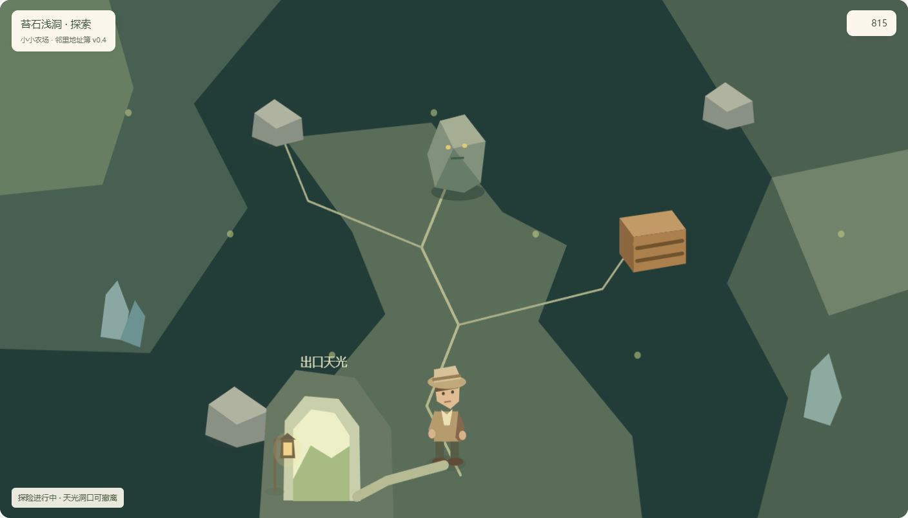

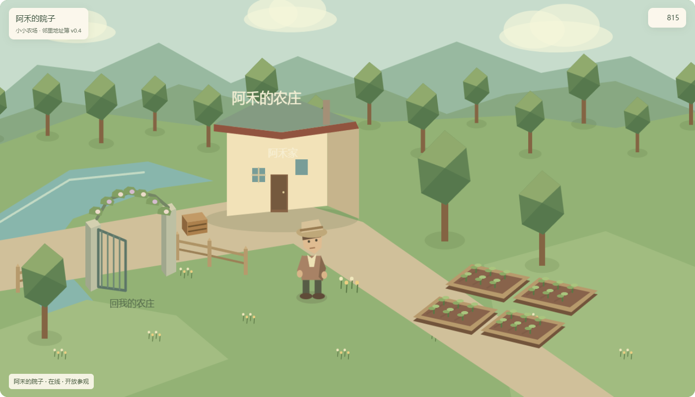

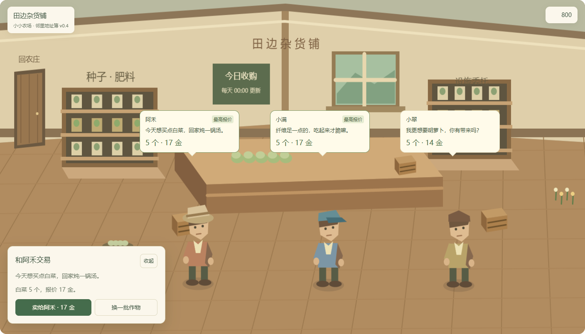

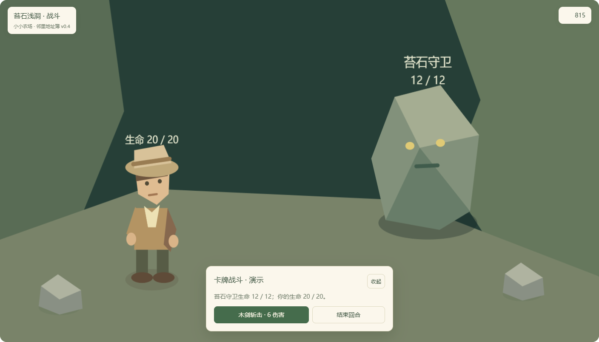
