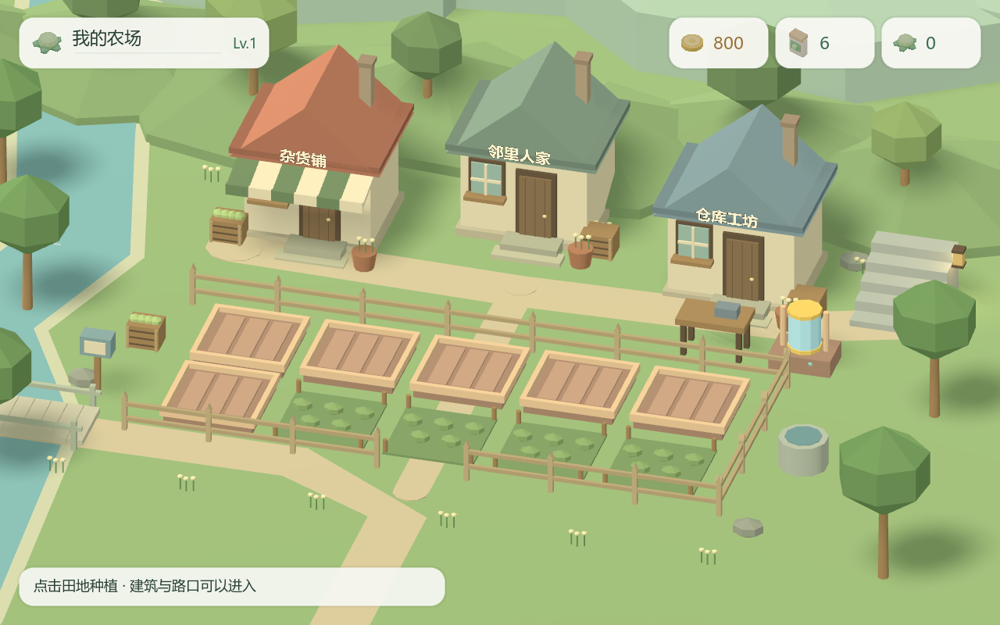
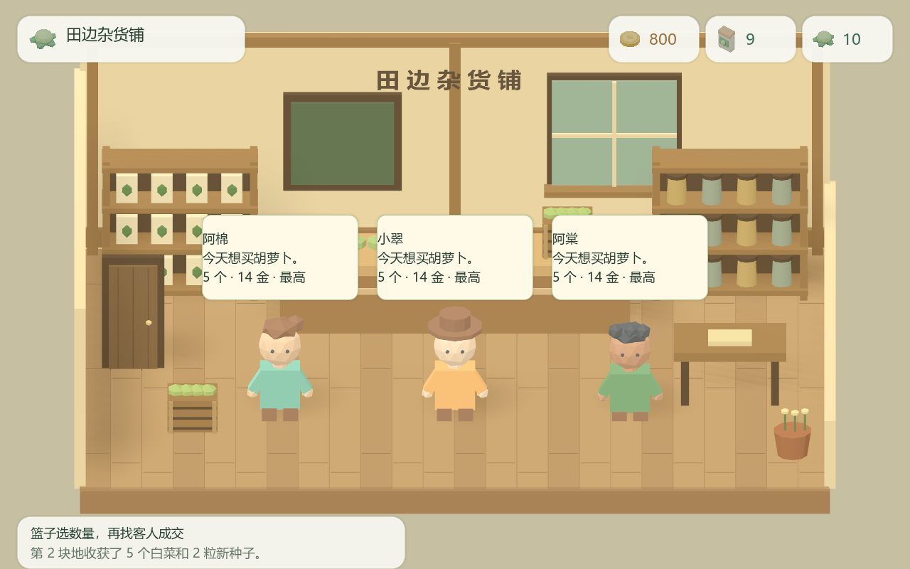
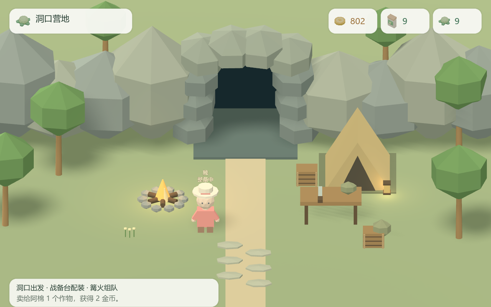
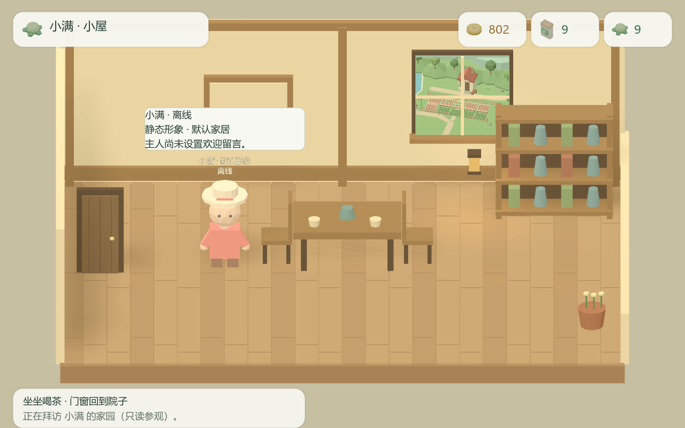

# 场景对齐：真实 Godot 运行画面

日期：2026-10-04。Godot 4.6.1 / Vulkan Mobile / RTX 4060 Ti。共 54 张截图，直接来自引擎渲染，没有后期改图。

[实施与验收记录](../../docs/testing/Farm_场景对齐实施与验收_2026-10-04.md) · [画廊](index.html) · [检查记录](verification.json) · [完整回归](regression.txt)

带 fixture 的画面使用构造的内存快照；线上意图测试与本地 WSS／合作回归分别记录，不代表公网真人双机验收。

## 主要世界画面

### 农场构图

### 商店三客报价

### 洞口营地

### 小屋与同一院子窗口

## 世界与工作区索引

| 图片 | 物理尺寸 | 内容 |
| --- | --- | --- |
| [01_farm](01_farm.png) | 1280×800 | 农场构图 |
| [02_farm_crops](02_farm_crops.png) | 1280×800 | 成熟田地 |
| [03_seed_workspace](03_seed_workspace.png) | 1280×800 | 播种工作区 |
| [04_shop](04_shop.png) | 1280×800 | 商店三客报价 |
| [05_basket](05_basket.png) | 1280×800 | 作物篮 |
| [06_guest_trade](06_guest_trade.png) | 1280×800 | 指定客人交易 |
| [07_camp](07_camp.png) | 1280×800 | 洞口营地 |
| [08_yard](08_yard.png) | 1280×800 | 六块主人地／三阶段 |
| [09_house](09_house.png) | 1280×800 | 小屋与同一院子窗口 |
| [10_return_farm](10_return_farm.png) | 1280×800 | 拜访返回农场 |
| [11_expansion](11_expansion.png) | 1280×800 | 未开垦地扩地 |
| [12_shop_shelf](12_shop_shelf.png) | 1280×800 | 种子货架 |
| [13_warehouse](13_warehouse.png) | 1280×800 | 农场仓库侧区 |
| [14_breeder](14_breeder.png) | 1280×800 | 育种侧区 |
| [15_crafting](15_crafting.png) | 1280×800 | 制作配方与成长标签 |
| [16_loadout](16_loadout.png) | 1280×800 | 战备精确拖放后 |
| [17_equipment_warehouse](17_equipment_warehouse.png) | 1280×800 | 装备仓库 |
| [18_local_room](18_local_room.png) | 1280×800 | 本地组队营地工作区 |
| [19_cave_workspace](19_cave_workspace.png) | 1280×800 | 洞口出发工作区 |
| [20_loadout_1024](20_loadout_1024.png) | 1024×640 | 1024 配装 |
| [21_crafting_1024](21_crafting_1024.png) | 1024×640 | 1024 制作 |
| [22_farm_1440](22_farm_1440.png) | 1440×900 | 1440 农场 |
| [23_main_menu](23_main_menu.png) | 1280×800 | 实际农庄菜单 |
| [24_online_route_fixture](24_online_route_fixture.png) | 1280×800 | 线上路线意图夹具 |
| [25_online_votes_fixture](25_online_votes_fixture.png) | 1280×800 | 两人投票夹具 |
| [26_online_receipt_pending_fixture](26_online_receipt_pending_fixture.png) | 1280×800 | 结算等待快照夹具 |
| [27_online_receipt_applied_fixture](27_online_receipt_applied_fixture.png) | 1280×800 | 结算已应用夹具 |
| [28_local_coop_route_fixture](28_local_coop_route_fixture.png) | 1280×800 | 合作客机路线夹具 |
| [29_directory_fixture](29_directory_fixture.png) | 1280×800 | 邻里地址簿夹具 |
| [30_online_room_fixture](30_online_room_fixture.png) | 1280×800 | 线上房间状态夹具 |
| [31_online_login](31_online_login.png) | 1280×800 | 线上登录 |
| [32_camp_party_fixture](32_camp_party_fixture.png) | 1280×800 | 营地准备／离线队员夹具 |
| [33_yard_all_ten](33_yard_all_ten.png) | 1280×800 | 十块主人地完整显示 |
| [34_rare_seeds](34_rare_seeds.png) | 1280×800 | 岩芽／萤果专属图标 |
| [35_pause](35_pause.png) | 1280×800 | 暂停 |
| [36_settings](36_settings.png) | 1280×800 | 可滚动设置 |
| [37_iron_layer_fixture](37_iron_layer_fixture.png) | 1280×800 | 铁根矿窟夹具 |
| [38_crystal_layer_fixture](38_crystal_layer_fixture.png) | 1280×800 | 晶脉矿窟夹具 |

## 洞内真实操作截图

由 `tests/capture_expedition_redesign.gd` 生成，涵盖选牌、目标、牌堆、回合、路线预览、遭遇、搜刮、撤离、结算和小窗口。

| 图片 | 物理尺寸 |
| --- | --- |
| [01_camp_first_visit](expedition/01_camp_first_visit.png) | 1280×800 |
| [02_camp_ready](expedition/02_camp_ready.png) | 1280×800 |
| [03_battle](expedition/03_battle.png) | 1280×800 |
| [04_target_preview](expedition/04_target_preview.png) | 1280×800 |
| [05_pile_inspector](expedition/05_pile_inspector.png) | 1280×800 |
| [06_next_round](expedition/06_next_round.png) | 1280×800 |
| [07_victory](expedition/07_victory.png) | 1280×800 |
| [08_route](expedition/08_route.png) | 1280×800 |
| [09_route_preview](expedition/09_route_preview.png) | 1280×800 |
| [10_encounter](expedition/10_encounter.png) | 1280×800 |
| [11_rewards](expedition/11_rewards.png) | 1280×800 |
| [12_exit](expedition/12_exit.png) | 1280×800 |
| [13_extraction](expedition/13_extraction.png) | 1280×800 |
| [14_settlement](expedition/14_settlement.png) | 1280×800 |
| [15_small_window_ten_cards](expedition/15_small_window_ten_cards.png) | 1024×640 |
| [16_battle_history](expedition/16_battle_history.png) | 1280×800 |
